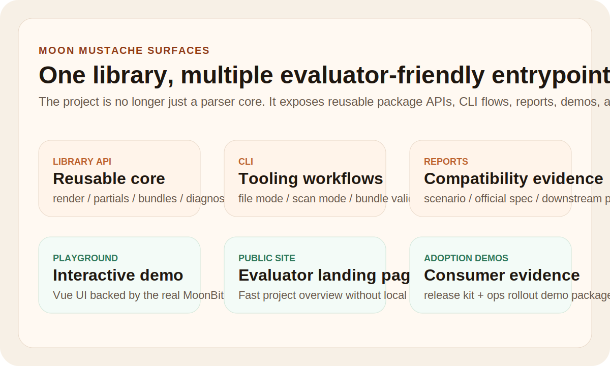

# Moon Mustache

[](https://github.com/bellesz0611/moon-mustache/actions/workflows/ci.yml)
[](https://github.com/bellesz0611/moon-mustache/actions/workflows/playground.yml)
[](https://github.com/bellesz0611/moon-mustache/actions/workflows/release-readiness.yml)
[](https://github.com/bellesz0611/moon-mustache/actions/workflows/site.yml)


Moon Mustache is a reusable Mustache template engine for MoonBit.

Moon Mustache 面向 MoonBit 生态提供一套轻量、稳定、可嵌入的模板渲染能力，重点服务于脚手架生成、配置文件拼装、静态内容渲染、邮件与通知模板、代码生成辅助等真实工程场景。

## Visual tour




## Judge quick look

- latest GitHub workflows: library CI and playground smoke checks are green on the default branch
- public repositories: GitHub + GitLink are synchronized
- current code scale: about `7459` MoonBit LOC across library, CLI, demos, reports, benchmarks, consumer scenarios, bridge code, and companion blueprint proof
- handwritten MoonBit LOC: about `5946`
- imported official generated fixture asset: `1513` LOC
- automated tests: `64 / 64` passing
- imported official `mustache/spec` fixtures: `136 / 136` passing
- public git history: `37+` commits and still growing
- key demos: CLI rendering, template scanning, bundle generation, scenario report, four consumer-style demos, and a Vue playground backed by the repository's own MoonBit engine
- extra evidence: second adoption-oriented consumer demo, benchmark snapshot, public static site, and SVG showcase assets

Fastest evaluator path:

```bash
moon test --deny-warn
moon run showcase
moon run official_spec_report
moon run cli --template "{{#user}}{{name}}{{/user}}{{> footer}}" --scan
```

## Repository

- GitHub: <https://github.com/bellesz0611/moon-mustache>
- GitLink: <https://www.gitlink.org.cn/miemie0619/moon-mustache-mbt>
- MoonBit package: `bellesz0611/moon-mustache`
- current release status: published on mooncakes.io as `bellesz0611/moon-mustache@0.1.0`
- workflow entrypoints: [library CI](https://github.com/bellesz0611/moon-mustache/actions/workflows/ci.yml) and [playground smoke workflow](https://github.com/bellesz0611/moon-mustache/actions/workflows/playground.yml)
- release-readiness workflow: [artifact-oriented verification](https://github.com/bellesz0611/moon-mustache/actions/workflows/release-readiness.yml)
- static showcase site workflow: [GitHub Pages deployment](https://github.com/bellesz0611/moon-mustache/actions/workflows/site.yml)
- evaluator quick-look page: [docs/JUDGE_QUICKLOOK.md](D:/CCF/moonbit/docs/JUDGE_QUICKLOOK.md)
- site pages in repo: [site/index.html](D:/CCF/moonbit/site/index.html), [site/adoption.html](D:/CCF/moonbit/site/adoption.html), [site/faq.html](D:/CCF/moonbit/site/faq.html)

## Project positioning

MoonBit 已经具备出色的语言设计和统一工具链，但“把结构化数据可靠地转成文本输出”这类基础能力仍然比较稀缺。很多项目都会重复造一层简单模板系统，而 Mustache 恰好是一种边界清晰、跨语言生态广泛存在、适合作为通用基础库移植到 MoonBit 的方案。

Moon Mustache 选择以 Mustache 规范为核心，优先把最常用、最稳定、最容易复用的能力做好，而不是扩展成一个语法复杂的新模板语言。

## Current status

当前版本已经不是启动壳仓库，而是一个具备核心渲染能力、CLI 工具链、规范测试、基准、场景报告和多文件生成演示的可运行项目。

代码规模口径拆分如下：

- 手写 MoonBit 代码约 `5928` 行
- 导入上游 fixture 后生成的 MoonBit 测试资产约 `1513` 行
- 合计约 `7441` 行 MoonBit 代码

也就是说，这个仓库不是靠“纯导入文件”撑规模；仅手写实现与演示部分也已经进入赛事建议体量区间。当前重点能力包括：

- 模板扫描、Token 化与 AST 解析
- 模板变量/Partial 引用扫描
- HTML 转义变量与非转义变量
- Section / Inverted Section
- Comment
- Partial
- Delimiter change
- standalone line trimming for section-like tags
- dotted lookup
- array iteration
- `{{.}}` 当前上下文访问
- JSON 上下文转换
- `RenderOptions` 严格模式与缺失变量诊断
- dotted assignment 上下文构造与上下文合并
- 多文件 bundle 渲染接口
- manifest profile 解析与批量模板工程生成
- bundle path normalization、validation 和 generation plan
- bundle render report / scenario report 导出
- CLI 文件输入与输出流程
- spec compatibility report
- official `mustache/spec` fixture import and report generation
- 独立 downstream consumer 包示例
- benchmark 入口与真实脚手架 demo
- 64 个自动化测试
- 覆盖 `fmt / info / check / test / showcase / scaffold_demo / spec_report / official_spec_report / scenario_report / downstream_consumer / benchmarks / cli-file-flow / cli-scan / bundle-check-only` 的库工作流
- 独立的 Vue playground build + API bridge smoke workflow

## Project surfaces

为了让项目不只是“库代码可运行”，Moon Mustache 现在同时提供几类不同层次的入口：

- library API
  供 MoonBit 包直接依赖和嵌入
- CLI
  供模板渲染、文件输入输出、bundle 校验和扫描分析使用
- reports
  供评审和使用者快速查看 spec 兼容性、场景报告和 bundle 计划
- downstream consumer
  证明该库可以被另一个 MoonBit 包复用，而不是只能在本仓库自测
- adoption demo
  证明该库还可以支撑第二类真实场景，这里是面向运维 rollout kit 的多文件生成流程
- content pipeline demo
  证明该库还能支撑文档、公告和 HTML 片段生成这一类内容生产工作流
- starter repo demo
  证明该库可以作为 MoonBit starter repository 生成器的核心渲染能力
- companion repo blueprint
  证明该库已经可以被整理成接近“独立外部仓库”形态的消费方项目结构
- Vue playground
  供用户在浏览器里实时修改模板、JSON 和 partials，直接看到 MoonBit 引擎输出
- static showcase site
  供评审快速浏览项目定位、样例输出和关键指标，不依赖本地启动环境

## Community health

为了让这个仓库更接近长期维护的开源项目，而不只是一次性比赛提交，当前仓库也补齐了基础协作入口：

- `CONTRIBUTING.md`
- `CODE_OF_CONDUCT.md`
- `GOVERNANCE.md`
- `SECURITY.md`
- `SUPPORT.md`
- `PROGRESS.md`
- GitHub issue templates for bugs and feature requests
- GitHub pull request template
- Dependabot configuration for GitHub Actions and the Vue playground dependencies

如果你想快速理解项目当前成熟度和功能落点，可以直接看：

- [PROGRESS.md](D:/CCF/moonbit/PROGRESS.md)
- [docs/IMPLEMENTATION_STATUS.md](D:/CCF/moonbit/docs/IMPLEMENTATION_STATUS.md)
- [docs/COMPARISON.md](D:/CCF/moonbit/docs/COMPARISON.md)
- [docs/SHOWCASE_GALLERY.md](D:/CCF/moonbit/docs/SHOWCASE_GALLERY.md)
- [docs/BENCHMARK_SNAPSHOT.md](D:/CCF/moonbit/docs/BENCHMARK_SNAPSHOT.md)
- [docs/RELEASE_HISTORY.md](D:/CCF/moonbit/docs/RELEASE_HISTORY.md)
- [docs/FAQ.md](D:/CCF/moonbit/docs/FAQ.md)
- [docs/DESIGN_CHOICES.md](D:/CCF/moonbit/docs/DESIGN_CHOICES.md)
- [docs/ADOPTION_GUIDE.md](D:/CCF/moonbit/docs/ADOPTION_GUIDE.md)
- [docs/ADOPTION_EVIDENCE.md](D:/CCF/moonbit/docs/ADOPTION_EVIDENCE.md)
- [docs/KNOWN_LIMITATIONS.md](D:/CCF/moonbit/docs/KNOWN_LIMITATIONS.md)
- [docs/COMMUNITY_POST.md](D:/CCF/moonbit/docs/COMMUNITY_POST.md)
- [docs/JUDGE_PITCH.md](D:/CCF/moonbit/docs/JUDGE_PITCH.md)
- [docs/SUBMISSION_INDEX.md](D:/CCF/moonbit/docs/SUBMISSION_INDEX.md)
- [companion_repo_blueprint/README.md](D:/CCF/moonbit/companion_repo_blueprint/README.md)

## Quick start

Start here:

- fastest first run: `moon run cli`
- command cookbook: `moon run cli --examples`
- copy the built-in demo template: `moon run cli --print-default-template`
- inspect the sample bundle manifest: `moon run cli --print-sample-manifest`
- detailed onboarding: `docs/QUICKSTART.md`

Prerequisites:

- MoonBit toolchain
  - recommended competition baseline: `0.10.3`
- Node.js when running file-based CLI flows on `js` target

Verify the repository:

```bash
moon check
moon test
```

Run the most direct demos:

```bash
moon run showcase
moon run scenario_report
moon run official_spec_report
```

Run the Vue playground locally:

```bash
cd playground
npm install
npm run dev
```

Use the file-oriented CLI flow:

```bash
moon run --target js cli --template-file "examples/files/template.mustache" --json-file "examples/files/context.json" --partials-json-file "examples/files/partials.json"
```

If you are deciding between library embedding and CLI usage, read [docs/QUICKSTART.md](D:/CCF/moonbit/docs/QUICKSTART.md).

## Target support

- core parsing and rendering library: `wasm-gc` and `js`
- scenario, report, and benchmark entrypoints: validated in CI
- file-backed CLI workflows: currently rely on the `js` target through the Node.js bridge
- the Vue playground uses a local Node render bridge that calls the repository's own MoonBit engine

## Supported syntax

| Syntax | Meaning | Status |
| --- | --- | --- |
| `{{name}}` | escaped variable | supported |
| `{{{name}}}` / `{{& name}}` | unescaped variable | supported |
| `{{#items}}...{{/items}}` | section | supported |
| `{{^empty}}...{{/empty}}` | inverted section | supported |
| `{{! note }}` | comment | supported |
| `{{> card}}` | partial | supported |
| `{{=<% %>=}}` | delimiter change | supported |
| standalone section/comment/partial lines | whitespace trimming | supported |
| `{{user.name}}` | dotted lookup | supported |
| `{{.}}` | current context | supported |

## Example

Template:

```mustache
{{#users}}
- {{name}} <{{email}}>
{{/users}}
{{^users}}
No users found.
{{/users}}
{{> footer}}
```

Context:

```json
{
  "users": [
    { "name": "Alice", "email": "alice@example.com" },
    { "name": "Bob", "email": "bob@example.com" }
  ]
}
```

Partials:

```json
{
  "footer": "Generated by Moon Mustache."
}
```

Output:

```text
- Alice <alice@example.com>
- Bob <bob@example.com>
Generated by Moon Mustache.
```

## Public API

当前接口分成两层，避免把“稳定核心库能力”和“比赛展示/工作流辅助能力”混在一起理解。

Core library API:

- `parse(template)`
- `render(template, context)`
- `render_with_partials(template, context, partials)`
- `render_checked(template, context)`
- `render_with_partials_checked(template, context, partials)`
- `render_checked_with_options(template, context, options)`
- `render_with_partials_checked_with_options(template, context, partials, options)`
- `parse_json_context(json)`
- `scan_template_variables(template)`
- `scan_template_references(template)`
- `scan_template_partials(template)`
- `render_json(...)` / `render_json_checked(...)`
- `render_json_checked_with_options(...)`
- `parse_json_partials_checked(json)`
- `render_json_bundle_checked(template, context_json, partials_json)`
- `render_json_bundle_checked_with_options(...)`
- `object_from_string_entries(entries)` / `merge_values(base, incoming)`
- `render_template_bundle_checked(bundle, context, options)`
- `render_template_bundle_json_checked(bundle, context_json, options)`
- `parse_bundle_manifest_json(json)`
- `resolve_bundle_manifest_profile(manifest, runtime_context, profile_name)`
- `render_bundle_manifest_checked(...)`
- `validate_template_bundle(bundle)` / `validate_bundle_manifest(manifest)`
- `build_bundle_plan(bundle_name, render_result, validation_result)`

Companion workflow/report helpers:

- `format_bundle_result_markdown(...)` / `format_bundle_result_json(...)`
- `format_validation_report_markdown(...)`
- `format_bundle_plan_markdown(...)`
- `run_official_spec_report()` / `format_official_spec_report_markdown(...)`
- `run_scenario_report()` / `format_scenario_report_markdown(...)`

这种设计更适合作为其他 MoonBit 工具链和应用层库的基础依赖，而不会把上层项目绑死在一个过重的模板框架里。

## Compatibility direction

项目当前同时维护两层兼容性验证：

- 仓库内 hand-written spec-style suite，用于快速回归和行为补充
- 从官方 `mustache/spec` 直接导入的 fixture，用于上游语义对齐

当前 spec-style suite 覆盖：

- interpolation
- comments
- sections
- inverted sections
- partials
- delimiters
- standalone lines
- whitespace-sensitive cases
- diagnostics cases

当前共有：

- `47` 个仓库内 spec-style case，分布在 `9` 个 suite 中，全部通过
- `136` 个官方导入 fixture，全部通过
- 最新 GitHub CI 为绿色，能直接复现 `fmt / info / check / test` 与 demo smoke paths
- 上游 fixture 的原始 JSON 与许可证已归档在 `third_party/mustache-spec/`

这让仓库的测试不只是“我们自己觉得对”，而是能直接对照上游 Mustache 规范资产。

## CLI demo

仓库内提供了一个轻量 CLI，用于快速演示模板渲染能力。

Run the built-in demo:

```bash
moon run cli
```

Render an inline template:

```bash
moon run cli --template "Hello {{name}}" --var name=MoonBit
```

Render with partials:

```bash
moon run cli --template "{{> card}}" --partial "card={{name}} builds tooling." --var name=MoonBit
```

Render with dotted variables and typed values:

```bash
moon run cli --template "{{user.name}}/{{enabled}}/{{count}}" --var user.name=Alice --var enabled=true --var count=3
```

Render with strict diagnostics:

```bash
moon run cli --template "A{{> missing}}B" --strict
```

Print a short cookbook of common commands:

```bash
moon run cli --examples
```

Scan referenced data names and partials:

```bash
moon run cli --template "{{#user}}{{name}}{{/user}}{{> footer}}" --scan
```

Front-end playground:

- `playground/` provides a Vue + Vite demo surface for judges and users
- it renders through a dedicated `playground_bridge` MoonBit entrypoint instead of a third-party Mustache implementation

Track missing variables as diagnostics:

```bash
moon run cli --template "Hello {{name}}" --strict --strict-missing
```

Render a bundle manifest into an output directory:

```bash
moon run --target js cli --bundle-manifest-file "examples/bundle/manifest.json" --json-file "examples/bundle/context.json" --bundle-output-dir "out_bundle_demo"
```

Render a profile-specific bundle and emit a JSON report:

```bash
moon run --target js cli --bundle-manifest-file "examples/bundle/manifest.json" --bundle-profile prod --json-file "examples/bundle/context.json" --bundle-output-dir "out_bundle_demo" --bundle-report-file "out_bundle_demo/report.json" --bundle-report-format json
```

Validate and plan a bundle without writing generated files:

```bash
moon run --target js cli --bundle-manifest-file "examples/bundle/manifest.json" --bundle-profile dev --json-file "examples/bundle/context.json" --bundle-check-only --bundle-validation-file "out_bundle_check/validation.md" --bundle-plan-file "out_bundle_check/plan.md"
```

Render with JSON context:

```bash
moon run cli --json "{\"name\":\"MoonBit\",\"role\":\"renderer\"}" --template "Hello {{name}}, core={{role}}"
```

PowerShell-friendly JSON input:

```bash
$json='{"name":"MoonBit","role":"renderer"}'
$encoded=[Convert]::ToBase64String([System.Text.Encoding]::UTF8.GetBytes($json))
moon run cli --json-base64 $encoded --template "Hello {{name}}, core={{role}}"
```

Render from files:

```bash
moon run --target js cli --template-file "examples/files/template.mustache" --json-file "examples/files/context.json" --partials-json-file "examples/files/partials.json"
```

Write output to a file:

```bash
moon run --target js cli --template-file "examples/files/template.mustache" --json-file "examples/files/context.json" --partials-json-file "examples/files/partials.json" --output "rendered.txt"
```

说明：

- 默认 `moon run cli` 适合直接传字符串参数的演示场景
- 文件读写能力当前通过 Node.js 文件桥接提供，因此请使用 `moon run --target js cli ...`

## Demo entrypoints

Quick project demos shipped in the repo:

- `moon run showcase`
  展示配置生成、邮件模板、HTML 片段和项目摘要四类场景。
- `moon run scaffold_demo`
  展示多文件脚手架生成，输出 `.env`、`compose.yaml`、`README.generated.md`。
- `moon run spec_report`
  输出 Markdown 兼容性报告。
- `moon run official_spec_report`
  输出基于官方 `mustache/spec` 导入 fixture 的兼容性报告。
- `moon run scenario_report`
  输出“真实工作流是否跑通”的场景报告，适合展示项目落地性。
- `moon run benchmarks`
  输出核心渲染路径的 benchmark 摘要。
- `moon run --target js cli --bundle-check-only ...`
  可直接作为 bundle manifest 的校验和生成计划入口，适合接 CI。
- `moon run downstream_consumer`
  运行独立 downstream consumer 包，证明公开 API 可以被其他 MoonBit 包直接复用。

## Repository layout

- `src/`: core scanner, parser, context, renderer, bundle APIs, spec suites, and tests
- `cli/`: demo command-line renderer
- `showcase/`: quick scenario-oriented demos
- `scaffold_demo/`: multi-file project generation demo
- `spec_report/`: compatibility report entrypoint
- `official_spec_report/`: upstream fixture compatibility report entrypoint
- `scenario_report/`: workflow-style scenario report entrypoint
- `downstream_consumer/`: separate package proving public API reuse
- `benchmarks/`: performance smoke benchmarks
- `playground/`: Vue playground for interactive template rendering demos
- `playground_bridge/`: MoonBit JSON bridge used by the playground API
- `examples/`: sample templates and expected output
- `third_party/mustache-spec/`: imported upstream official spec fixtures
- `THIRD_PARTY_NOTICES.md`: source and license notes for imported third-party assets
- `docs/`: architecture notes, roadmap, and competition materials
- `docs/EVALUATION_SUMMARY.md`: concise evaluator-facing project strengths
- `docs/QUICKSTART.md`: user-oriented onboarding guide
- `docs/STABILITY.md`: API stability tiers and versioning direction
- `docs/BENCHMARKS.md`: benchmark interpretation and next steps
- `docs/FINAL_ACCEPTANCE_REPORT.md`: final acceptance readiness summary
- `.github/workflows/`: CI configuration

## License and third-party assets

- repository license: MIT
- imported upstream fixture source: `mustache/spec` under MIT
- third-party notice file: `THIRD_PARTY_NOTICES.md`
- preserved upstream license text: `third_party/mustache-spec/LICENSE`

## Stability and release posture

- current package stage: pre-`1.0`
- core library APIs are the main long-term compatibility target
- report helpers and CLI UX can still evolve faster than the rendering core
- versioning and public-surface expectations are documented in [docs/STABILITY.md](D:/CCF/moonbit/docs/STABILITY.md)
- publishing notes and release verification history live in [docs/PUBLISHING.md](D:/CCF/moonbit/docs/PUBLISHING.md)

## Engineering direction

项目后续会继续沿着“可复用基础库”方向完善，而不是只为了比赛提交一个一次性 Demo。下一步重点包括：

- 保持与 upstream `mustache/spec` 的同步更新流程
- 引入 target-agnostic 的文件级生成和写出能力
- 补充更细粒度的 diagnostics 分类与报告导出
- 丰富 bundle API、manifest profile 和脚手架场景中的使用样例
- 继续维护 mooncakes.io 发布版本、版本化说明和包文档

## Reference projects

- [mustache/spec](https://github.com/mustache/spec)
- [mustache.js](https://github.com/janl/mustache.js)

## Why this matters for MoonBit

这个项目的价值不只是“能渲染字符串”，而是为 MoonBit 生态补上一块很多工具都会复用的底层积木：

- 脚手架工具可以直接复用
- 配置生成和文本生成类工具可以减少重复造轮子
- 静态站点、文档工具、消息系统可以复用统一模板能力
- 多文件生成器可以直接基于 bundle API 构建
- 后续如果做代码生成器、邮件渲染器、站点构建器，也能直接建立在这套核心库之上
