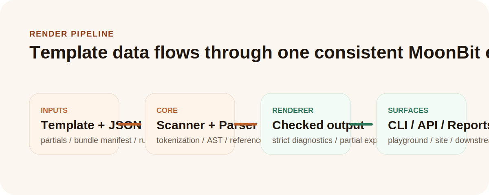

# Moon Mustache

[](https://github.com/bellesz0611/moon-mustache/actions/workflows/ci.yml)
[](https://github.com/bellesz0611/moon-mustache/actions/workflows/playground.yml)
[](https://github.com/bellesz0611/moon-mustache/actions/workflows/site.yml)


Moon Mustache is a reusable Mustache template engine and safe multi-file generator for MoonBit.

它把结构化数据可靠地转换为配置、文档、通知和项目文件，并提供解析诊断、严格模式、Bundle 校验、资源限制与跨实现一致性测试。核心库可嵌入 MoonBit 项目；CLI 和浏览器 Playground 用于直接运行同一套 MoonBit 引擎。

- [在线 Playground](https://bellesz0611.github.io/moon-mustache/)
- [测试证据面板](https://bellesz0611.github.io/moon-mustache/#evidence)
- [Mooncakes 0.2.0](https://mooncakes.io/docs/bellesz0611/moon-mustache%400.2.0)
- [5 分钟上手](docs/QUICKSTART.md)
- [API 指南](docs/API.md)
- [当前可复现指标](docs/METRICS_SNAPSHOT.md)



## 60 秒体验

要求：MoonBit 工具链；文件读写与 Playground 还需要 Node.js。

```bash
moon run cli --template "Hello {{name}}" --var name=MoonBit
```

输出：

```text
Hello MoonBit
```

直接验证仓库：

```bash
moon check --deny-warn
moon test --deny-warn --target wasm-gc
python scripts/test_cli_integration.py
```

也可以用一个命令生成带逐步日志和 JSON 摘要的验收证据：

```bash
python scripts/verify.py
```

## 一个完整任务：安全生成项目文件

示例 manifest 同时定义文件模板、共享 partial 和 `dev` / `prod` profile。下面的命令先合并 JSON 上下文，再生成 `.env`、README 和部署配置：

```bash
moon run --target js cli \
  --bundle-manifest-file examples/bundle/manifest.json \
  --bundle-profile dev \
  --json-file examples/bundle/context.json \
  --bundle-output-dir out_bundle_demo \
  --bundle-validation-file out_bundle_demo/validation.md \
  --bundle-plan-file out_bundle_demo/plan.md
```

如果只想在 CI 中检查，不写生成文件：

```bash
moon run --target js cli \
  --bundle-manifest-file examples/bundle/manifest.json \
  --bundle-profile dev \
  --json-file examples/bundle/context.json \
  --bundle-check-only \
  --strict --strict-missing
```

严格模式遇到缺失变量、解析错误或不安全输出路径时会阻止生成，并返回非零退出码。

## 为什么不是简单的字符串替换

Moon Mustache 围绕“可复用、可诊断、可验证”设计：

- 完整的 scanner → token → AST → renderer 流水线
- 变量、Section、Inverted Section、Partial、Delimiter、Lambda 和继承扩展
- compile-once / render-many 的 prepared template 与 prepared bundle
- 稳定错误码、源码范围、行列号、上下文片段和修复提示
- 输出长度、迭代次数、渲染步骤与 Partial 深度限制
- Bundle 路径标准化、父目录穿越拦截、profile 合并和生成计划
- MoonBit `wasm`、`wasm-gc`、`js`、`native` 四后端 CI
- CLI、MoonBit 包、浏览器 ESM 共用核心实现

## 测试证据

测试不是一个总数，而是针对不同风险的分层证据：

| 层次 | 回答的问题 | 自动化入口 |
| --- | --- | --- |
| 单元与回归 | scanner、parser、renderer 和诊断是否保持行为 | `moon test --deny-warn` |
| 上游规范 fixture | 是否与固定提交的 `mustache/spec` 核心和可选语义一致，来源是否漂移 | `python scripts/verify_official_spec_fixtures.py && moon run official_spec_report` |
| 跨实现差分 | 随机组合输入是否与 `mustache.js` 输出一致，失败是否能自动缩成最小样本 | `cd playground && npm run differential` |
| CLI 黑盒集成 | 退出码、文件 IO、lint 和 Bundle 产物是否正确 | `python scripts/test_cli_integration.py` |
| 覆盖率门禁 | 核心库与 CLI 可测决策层是否出现未测试回退 | `python scripts/run_coverage.py --minimum 90 --cli-core-minimum 70` |
| 可控故障注入 | 关键测试能否识别转义、truthiness、路径、深度与父上下文故障 | `python scripts/run_fault_injection.py` |
| 多后端黄金一致性 | 同一输出和诊断 corpus 在四个编译目标是否逐字节一致 | `python scripts/test_backend_conformance.py`，CI 强制包含 native |

官方 fixture 的来源和许可证保留在 `third_party/mustache-spec/`；差分测试使用固定 seed，可重复运行。精确测试数、fixture 通过数和核心覆盖率只在自动生成的 [Metrics Snapshot](docs/METRICS_SNAPSHOT.md) 中维护，避免多处手工数字互相冲突。

专项鼓励奖对应证据与最短复现路径见 [专项鼓励奖证据索引](docs/SPECIAL_AWARD_EVIDENCE.md)。

## 常用 CLI

扫描模板依赖的数据和 Partial：

```bash
moon run cli --template "{{#user}}{{name}}{{/user}}{{> footer}}" --scan
```

在严格模式中检查缺失变量：

```bash
moon run cli --template "Hello {{name}}" --strict --strict-missing
```

从文件渲染：

```bash
moon run --target js cli \
  --template-file examples/files/template.mustache \
  --json-file examples/files/context.json \
  --partials-json-file examples/files/partials.json
```

打印更多可复制命令：

```bash
moon run cli --examples
```

## 支持的 Mustache 语法

| 语法 | 含义 | 状态 |
| --- | --- | --- |
| `{{name}}` | HTML 转义变量 | 支持 |
| `{{{name}}}` / `{{& name}}` | 非转义变量 | 支持 |
| `{{#items}}...{{/items}}` | Section / 数组迭代 | 支持 |
| `{{^empty}}...{{/empty}}` | Inverted Section | 支持 |
| `{{> card}}` | Partial | 支持 |
| `{{=<% %>=}}` | Delimiter change | 支持 |
| `{{user.name}}` / `{{.}}` | dotted lookup / 当前上下文 | 支持 |
| standalone tags | 独立行空白裁剪 | 支持 |
| dynamic partial、parent、block、lambda | 可选扩展 | 支持 |

完整矩阵见 [Compatibility Matrix](docs/COMPATIBILITY.md)，已知边界见 [Known Limitations](docs/KNOWN_LIMITATIONS.md)。

## 作为 MoonBit 库使用

稳定核心 API 包括：

- `parse`、`render`、`render_with_partials`
- `prepare` 与 prepared render 系列
- `render_checked_with_options`
- `parse_json_context` 与 JSON render 系列
- `scan_template_references`
- `TemplateBundle`、manifest、validation 与 plan 系列

类型、参数和错误行为见 [API Guide](docs/API.md)。可编译示例见 [Executable Examples](src/README.mbt.md)，API 稳定层级见 [Stability Policy](docs/STABILITY.md)。

## Playground

```bash
cd playground
npm ci
npm run dev
```

Playground 构建时编译仓库中的 MoonBit browser bridge，不依赖在线后端，也不以 `mustache.js` 代替产品实现。界面提供 Render、Diagnose、Compare、Evidence、Generate 五个视图：Compare 明确把 `mustache.js` 标为参考实现；Evidence 从生成指标快照展示规范、差分、Mutation、后端和 CLI 分层证据，并展开逐 mutant 检测器；Generate 则通过真实 `TemplateBundle` API 预览 `moon.mod`、README、源码、包配置和 CI 五个文件。入口默认中文并可切换英文。

## 架构

```text
template + context + partials
            │
            ▼
scanner → parser → prepared AST → checked renderer
                                      │
                      ┌───────────────┼───────────────┐
                      ▼               ▼               ▼
                  library API        CLI        browser bridge
```

Bundle 层在核心渲染器上增加 manifest/profile 解析、路径安全校验、批量渲染和报告输出。设计取舍见 [Architecture](docs/ARCHITECTURE.md) 与 [Design Choices](docs/DESIGN_CHOICES.md)。

## 仓库导航

- `src/`：核心实现、规范 fixture 适配与单元测试
- `cli/`：命令行入口和 Node 文件桥
- `browser_bridge/`、`playground/`：浏览器引擎与交互界面
- `examples/`：文件渲染和 Bundle 示例
- `scripts/`：覆盖率、差分、文档与验收自动化
- `third_party/mustache-spec/`：带许可证的上游 fixture
- `docs/`：API、架构、兼容性与维护文档
- `*_demo/`：下游场景证明，不属于核心库 API

## 发布与维护

- package：`bellesz0611/moon-mustache@0.2.0`
- stage：pre-`1.0`，核心 API 是主要兼容目标
- GitHub：<https://github.com/bellesz0611/moon-mustache>
- GitLink：<https://www.gitlink.org.cn/miemie0619/moon-mustache-mbt>
- 贡献指南：[CONTRIBUTING.md](CONTRIBUTING.md)
- AI 协作实践：[docs/AI_COLLABORATION.md](docs/AI_COLLABORATION.md)
- 安全策略：[SECURITY.md](SECURITY.md)
- 发布流程：[docs/PUBLISHING.md](docs/PUBLISHING.md)

## License

Moon Mustache 使用 MIT License。导入的 `mustache/spec` fixture 同样按其 MIT License 使用，来源与保留声明见 [THIRD_PARTY_NOTICES.md](THIRD_PARTY_NOTICES.md)。
